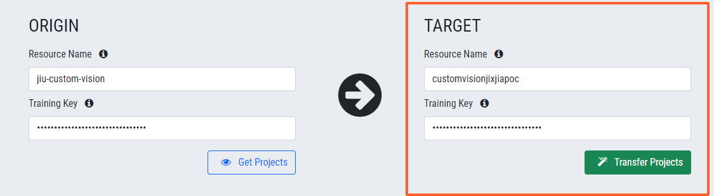

# Copy Custom Vision Projects
A simple UI app for facilitate copying Custom Vision projects (including the trained models, training images and project settings) across to another Azure subscription, location and/or resource group.

 

## Setup
#### Running on local

1. Clone this repo and run `python application.py` to start Flask WSGI app
2. Navigate to `localhost:5000` in your browser
3. Enjoy

#### Running in production

1. It is recommended to deploy the app against a production Nginx and Gunicorn web server
2. Configure the `nginx.conf` for server
3. Launch the app

 

## How-To 
Follow 3 easy steps to copy your projects between Custom Vision resources

1. Enter the source Custom Vision details and click **Get Projects**

2. From a list of Custom Vision projects pick desired ones

3. Enter the target Custom Vision details and click **Transfer Projects**

4. If everything entered correctly the transfer will complete successfully after a while

 

## Note
1. If the selected project already exists in target resource, a new project name with a numbered suffix will be created, *e.g. Custom Vision Project (1)*
2. You can copy up to 100 projects at a time, the upper limit imposed by Custom Vision