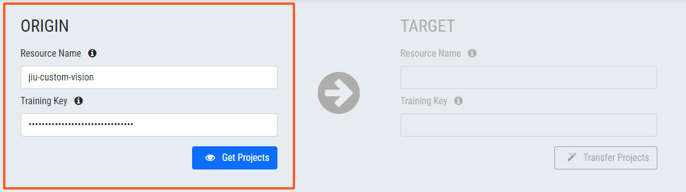
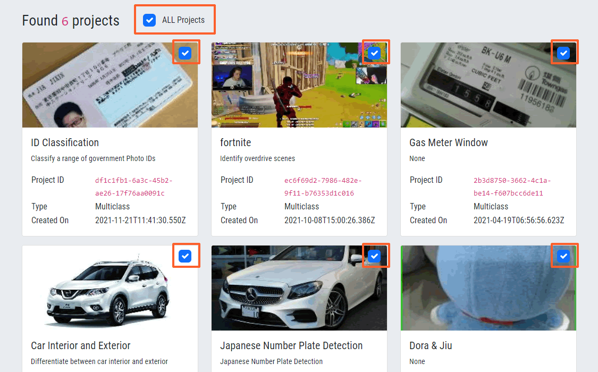

# Copy Custom Vision Projects
A simple UI app for facilitate copying Custom Vision projects (including the trained models, training images and project settings) across to another Azure subscription, location and/or resource group.

## Running on local

1. Clone this repo and run `python application.py` to start Flask WSGI app
2. Navigate to `localhost:5000` in your browser
3. Enjoy

## Running in Production

1. It is recommended to deploy the app against a production Nginx and Gunicorn web server
2. Configure the `nginx.conf` for server
3. Launch the app

## Copy Custom Vision Projects
Follow the 3 easy steps to copy your projects between Custom Vision resources

1. Enter source detail and click **Get Projects**

2. Pick desired projects

3. Enter target detail and hit **Transfer Projects**

4. Done !

## Note
1. If the selected project already exists in target resource, a new project name with a numbered suffix will be created, *e.g. Custom Vision Project (1)*
2. You can copy up to 100 projects at a time, the upper limit imposed by Custom Vision